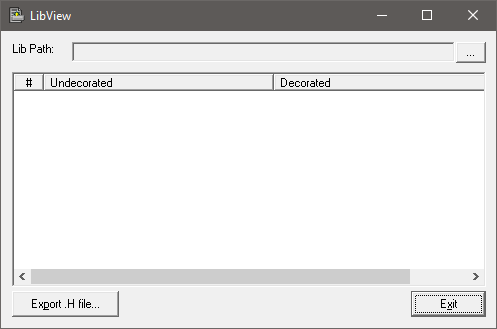

# LibView  - Static library viewer
Static Library export viewer - Windows Only

Origioanl code could be found here 

https://www.codeproject.com/Articles/9310/A-Tool-to-View-a-LIB

This version is modified and many bugs are fixed. There is no liciens at the paget, I hope that author wish to share it again.
I would like to preserve this project. This is useful when you have library without having header file or you want to check your library. 
This is tested on Windows 10. 
Visual studio 2022

##NOTE: IMPORTANT!!!!!
Use it at your own risk!!!!

Mariwan Jalal 2024-01-03

-------------------------------------------------

